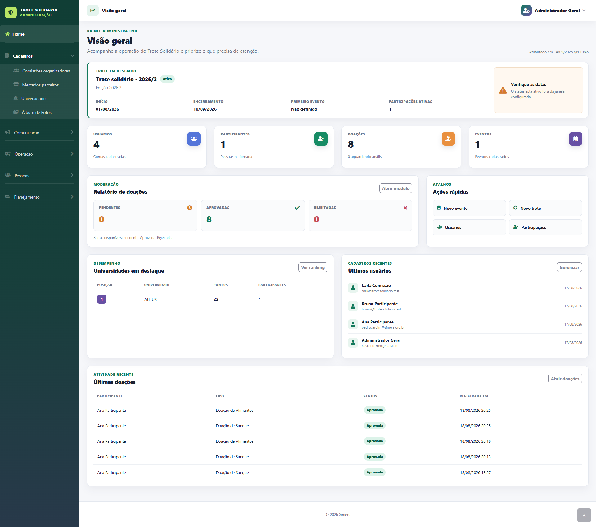
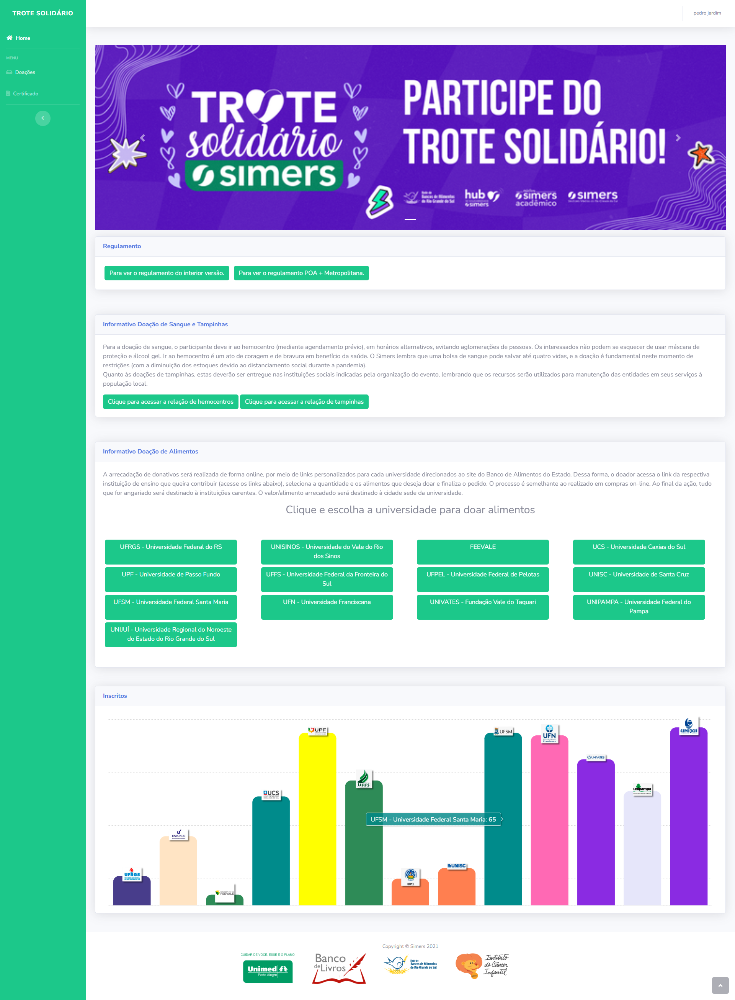
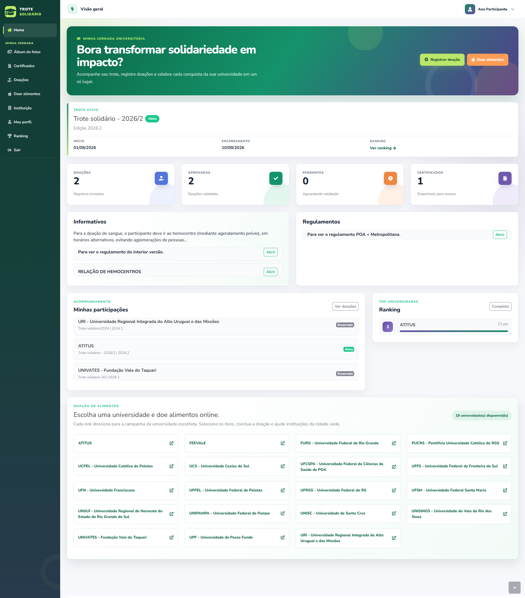
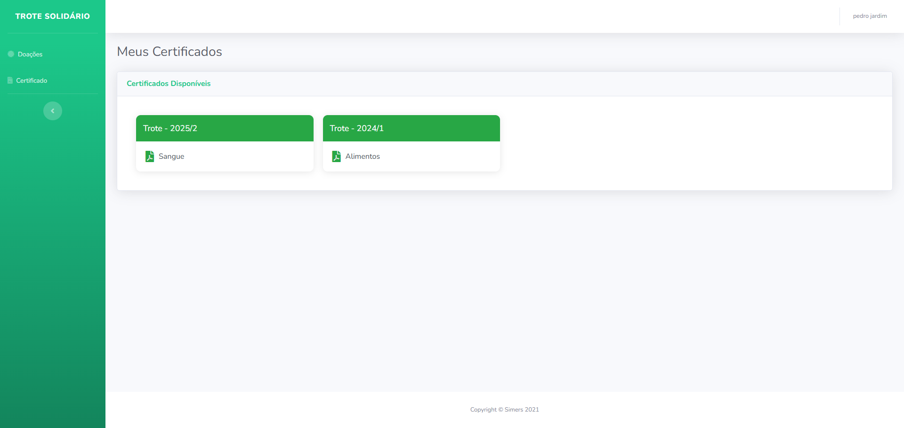
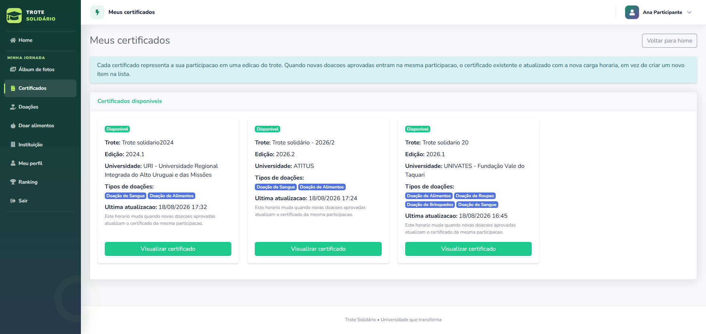
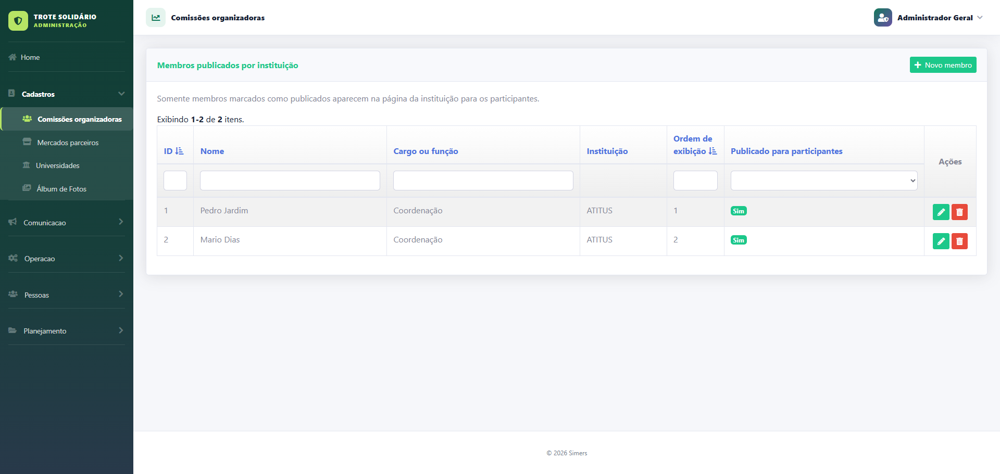
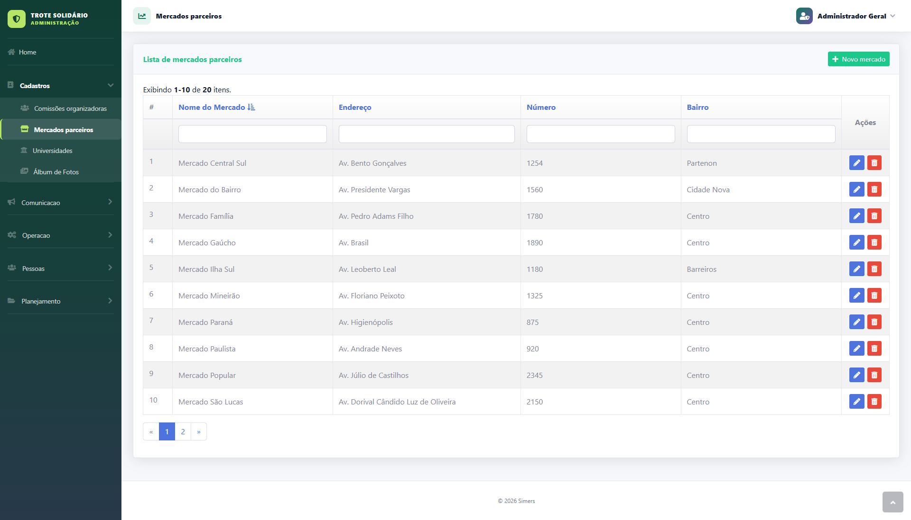
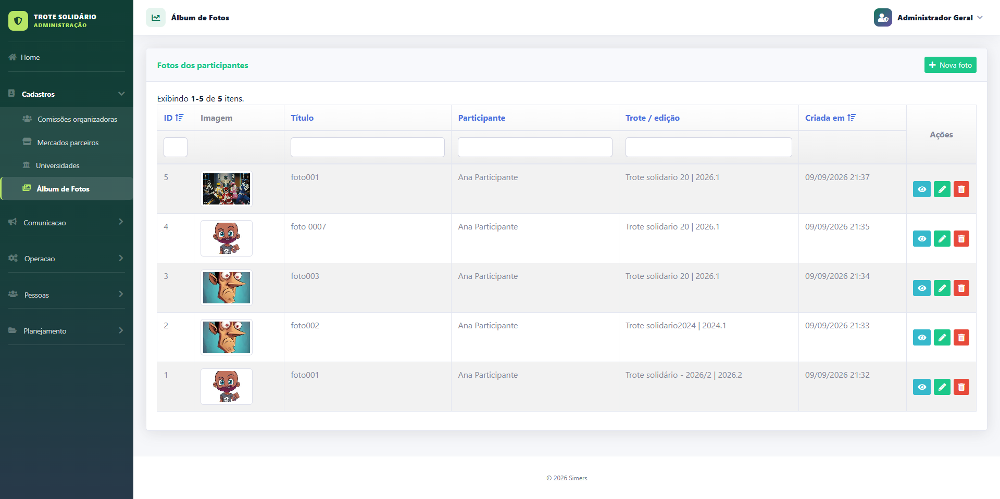
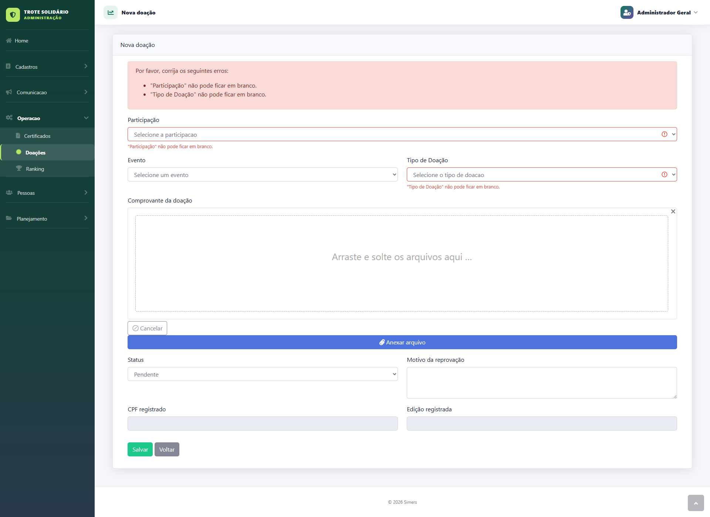

# Trote Solidário

Sistema web para administração e participação no Trote Solidário, com módulos para participantes, administração, doações, eventos, documentos, rankings e certificados em PDF.

## Sobre a refatoração

Este sistema **não foi desenvolvido do zero**. O projeto existente passou por uma **refatoração ampla**, realizada para modernizar e aprimorar a aplicação sem perder sua finalidade original nem os fluxos essenciais já consolidados.

O trabalho contemplou uma revisão completa e incremental do sistema, com foco em:

- aperfeiçoar as regras de negócio e tornar os comportamentos mais consistentes;
- corrigir falhas e reduzir riscos de manutenção;
- organizar responsabilidades e melhorar a legibilidade do código;
- padronizar os módulos e as interfaces administrativas;
- melhorar a experiência do usuário, a navegação e a clareza das ações;
- preservar a compatibilidade com os dados e processos existentes;
- aumentar a estabilidade da geração de documentos e certificados em PDF;
- preparar o projeto para evolução, testes e implantação mais segura.

A arquitetura continua baseada em PHP e Yii2, mas diversas áreas foram revistas para oferecer uma base mais confiável tanto para os usuários do sistema quanto para a equipe responsável por sua manutenção.

## Visão do produto

A refatoração transformou a área administrativa em uma experiência visual mais clara, organizada e orientada à operação. O painel reúne informações relevantes do evento, indicadores, alertas, atalhos e atividades recentes em uma única visão.



### Destaques da experiência

- dashboard com visão consolidada da operação e dados prioritários;
- navegação lateral organizada por contexto de trabalho;
- indicadores de participantes, doações, eventos e usuários;
- alertas visuais para situações que exigem atenção;
- tabelas administrativas com filtros, paginação e ações objetivas;
- formulários com validação clara e retorno imediato ao usuário;
- identidade visual consistente entre módulos;
- fluxos de cadastro e gestão mais previsíveis.

## Antes e depois da refatoração

### Área do participante

| Antes | Depois |
|---|---|
|  |  |
| Conteúdo extenso e pouco hierarquizado, navegação reduzida e informações importantes distribuídas em grandes blocos. | Jornada centralizada, ações rápidas, indicadores pessoais, status do evento, documentos, ranking e participações organizados por prioridade. |

A comparação evidencia que a refatoração foi além da identidade visual. A nova experiência aproxima a interface das regras de negócio: o participante identifica o trote ativo, acompanha doações aprovadas ou pendentes, acessa certificados, consulta suas participações e encontra os próximos passos sem precisar interpretar blocos extensos de conteúdo.

### Certificados do participante

| Antes | Depois |
|---|---|
|  |  |
| Cards resumidos, com pouca informação para diferenciar cada certificado e navegação limitada. | Certificados organizados por participação, com edição do trote, universidade, tipos de doação, última atualização, status e ação de visualização claramente identificados. |

A nova tela traduz melhor a regra de negócio: cada certificado representa uma participação e é atualizado quando novas doações são aprovadas para essa mesma participação. A explicação aparece no próprio contexto da página, reduzindo dúvidas e evitando a impressão de certificados duplicados.

## Galeria da interface refatorada

| Gestão de comissões organizadoras | Gestão de mercados parceiros |
|---|---|
|  |  |
| Publicação e ordenação dos membros exibidos aos participantes. | Consulta paginada, filtros por campo e ações administrativas diretas. |

| Álbum dos participantes | Cadastro e análise de doações |
|---|---|
|  |  |
| Gestão de imagens vinculadas ao participante e à edição do evento. | Formulário com validação contextual, upload de comprovante e controle de status. |

## Stack utilizada

| Camada | Tecnologia |
|---|---|
| Backend | PHP 8.2 no container de produção atual |
| Framework | Yii2 Basic 2.0.52 |
| Frontend | HTML5, CSS, JavaScript e Bootstrap 4 |
| Banco de dados | MySQL 5.7 |
| Servidor web | Nginx com PHP-FPM |
| Dependências | Composer |
| PDFs | mPDF, Kartik Yii2 mPDF e TCPDF |
| Imagens e QR Code | GD, Yii2 Imagine e chillerlan/php-qrcode |
| E-mail | Yii2 Symfony Mailer |
| Testes | PHPUnit e Codeception |
| Infraestrutura local | Docker Compose |

Outras extensões importantes incluem os componentes Kartik para grids, formulários, datas, exportação e widgets, além do módulo de usuários Dektrium.

## Estrutura principal

```text
.
├── docker/                 # Nginx, PHP-FPM e entrypoint
├── docs/                   # documentação local do projeto e do Yii2
├── src/
│   ├── commands/           # comandos de console e seeds
│   ├── config/             # configurações web, console e banco
│   ├── migrations/         # migrations do banco
│   ├── modules/            # módulos da aplicação
│   ├── runtime/            # cache, logs e temporários
│   ├── tests/              # testes automatizados
│   ├── vendor/             # dependências instaladas pelo Composer
│   └── web/                # único diretório público
├── docker-compose.yml
└── readme-docker.md        # instruções detalhadas do ambiente local
```

## Ambiente local

### Pré-requisitos

- Docker Engine;
- Docker Compose v2;
- Git.

### Configuração

Crie ou revise o arquivo `.env` na raiz. Nunca utilize credenciais de desenvolvimento em produção.

```env
DB_CONNECTION=mysql
DB_HOST=mysql-db
DB_PORT=3306
DB_DATABASE=trotesolidario
DB_USERNAME=usuario_da_aplicacao
DB_PASSWORD=senha_forte

MAILER_HOST=smtp.exemplo.com
MAILER_PORT=587
MAILER_ENCRYPTION=tls
MAILER_USERNAME=usuario_smtp
MAILER_PASSWORD=senha_smtp
MAILER_USE_FILE_TRANSPORT=false
```

Suba e prepare o ambiente:

```bash
docker compose up -d --build
docker compose exec php composer install
docker compose exec php php yii migrate --interactive=0
```

A aplicação local ficará disponível em `http://localhost:8080`.

As seeds existem para preparação de ambientes controlados:

```bash
docker compose exec php php yii seed/list
docker compose exec php php yii seed/all
```

Não execute seeds em produção sem revisar seu conteúdo e seus efeitos sobre os dados existentes.

## Guia para produção

O `docker-compose.yml` atual é adequado como base de desenvolvimento. Antes de utilizá-lo em produção, aplique os controles descritos abaixo ou mantenha uma configuração de produção separada.

### 1. Preparar servidor e domínio

- Instale Docker e Docker Compose atualizados.
- Configure DNS e HTTPS com certificado válido.
- Restrinja as portas no firewall; exponha publicamente apenas HTTP/HTTPS.
- Não publique a porta do MySQL na internet.
- Configure backup externo e monitoramento antes da entrada em operação.

O document root do servidor deve ser exclusivamente `src/web`. Nunca exponha a raiz do repositório, `src/config`, `src/runtime`, `.env` ou `src/vendor` diretamente.

### 2. Tratar segredos

- Gere senhas exclusivas e fortes para banco e SMTP.
- Não versione o `.env` de produção.
- Troque qualquer credencial que já tenha sido compartilhada ou versionada.
- Use um segredo aleatório e exclusivo para `cookieValidationKey`.
- Prefira secrets da plataforma, cofre de segredos ou arquivo protegido fora do repositório.

> Atenção: este repositório atualmente possui `.env` versionado e uma `cookieValidationKey` fixa em `src/config/web.php`. Isso deve ser corrigido antes do deploy público; apenas escrever valores novos diretamente nesses arquivos não é uma estratégia segura.

### 3. Ativar o ambiente de produção

Os entrypoints `src/web/index.php` e `src/yii` atualmente definem `YII_ENV` como `dev`. Antes do deploy, a aplicação deve iniciar com:

```php
defined('YII_DEBUG') or define('YII_DEBUG', false);
defined('YII_ENV') or define('YII_ENV', 'prod');
```

Isso impede o carregamento do Gii e do módulo de debug configurados para desenvolvimento. Não publique o sistema enquanto `YII_ENV_DEV` estiver ativo, pois o debug atual aceita qualquer IP.

### 4. Fixar imagens e preparar o Compose

Para implantação reproduzível:

- substitua imagens flutuantes como `nginx:latest` e `composer:latest` por versões fixas;
- mantenha PHP e extensões compatíveis com `src/composer.lock`;
- remova o mapeamento público `3309:3306` do MySQL;
- configure política de reinício para Nginx e PHP;
- evite bind mount do código-fonte em produção; prefira uma imagem imutável contendo o release;
- configure limites de recursos, health checks, logs e rotação;
- mantenha os dados do MySQL em volume persistente com backup fora do host.

### 5. Gerar e instalar o release

Faça o deploy de uma tag ou commit identificado. Dentro do container PHP, instale exatamente as versões travadas:

```bash
composer install --no-dev --prefer-dist --no-interaction --optimize-autoloader
```

Não use `composer update` durante o deploy. O comando `install` respeita o `composer.lock`; `update` pode selecionar versões diferentes das homologadas.

### 6. Banco de dados

Crie um backup consistente antes de atualizar:

```bash
docker compose exec -T mysql-db mysqldump \
  -uUSUARIO_BACKUP -p BANCO_PRODUCAO > backup-pre-deploy.sql
```

Proteja o arquivo gerado, valide se ele não está vazio e teste periodicamente o procedimento de restauração.

Depois do backup e da publicação do código, confira e aplique as migrations:

```bash
docker compose exec php php yii migrate/history
docker compose exec php php yii migrate --interactive=0
```

Migrations podem alterar dados e estrutura. Leia as migrations pendentes antes de executá-las e não reverta uma migration em produção sem confirmar que ela é reversível.

Caso a instalação inicial use um dump em vez das migrations, importe-o em um banco vazio e depois verifique o histórico de migrations. Detalhes do procedimento local estão em `readme-docker.md`.

### 7. Diretórios graváveis

O processo PHP precisa escrever somente nos diretórios operacionais:

```text
src/runtime/
src/web/assets/
src/web/img/
src/web/imagens/
src/web/pdf/
```

O entrypoint Docker cria esses diretórios, inclusive a área temporária do mPDF. Em produção, atribua-os ao usuário do PHP-FPM e use a menor permissão necessária. Evite `0777` em servidor público; o proprietário correto com `0755` ou `0775`, conforme o grupo do processo, é preferível.

Uploads e PDFs gerados precisam de armazenamento persistente. Sem volume, bucket ou rotina de sincronização, esses arquivos serão perdidos ao substituir o container.

### 8. Cache e desempenho

- mantenha o OPcache habilitado;
- instale dependências com autoload otimizado;
- mantenha `YII_DEBUG=false`;
- avalie cache de schema do banco após validar a estratégia de invalidação;
- comprima respostas e configure cache de arquivos estáticos no proxy/Nginx;
- monitore CPU, memória, espaço em disco, latência, erros PHP e conexões MySQL.

### 9. Validação antes da liberação

Execute, no mínimo:

```bash
docker compose config
docker compose exec php composer validate --no-check-publish
docker compose exec php php yii migrate/history
docker compose exec php vendor/bin/codecept run unit,functional
docker compose logs --tail=200 php nginx mysql-db
```

Faça também uma validação funcional manual:

- página inicial e autenticação;
- acesso do participante e do administrador;
- cadastro e edição das entidades principais;
- upload e download de documentos;
- envio real de e-mail;
- geração e download de certificados/PDFs;
- layout responsivo e páginas de erro;
- persistência dos uploads após recriar os containers.

### 10. Ordem recomendada de deploy

1. Definir uma janela de manutenção quando houver mudanças sensíveis.
2. Confirmar tag/commit e revisar as migrations pendentes.
3. Fazer backup do banco e dos uploads.
4. Construir a imagem do release e instalar dependências sem pacotes de desenvolvimento.
5. Publicar os containers sem expor o banco.
6. Aplicar as migrations.
7. Limpar cache antigo em `src/runtime/cache`, se necessário.
8. Executar smoke tests pela URL HTTPS.
9. Conferir logs e métricas.
10. Encerrar a manutenção somente após validar os fluxos críticos.

## Rollback

Antes do deploy, preserve a imagem ou release anterior. Se ocorrer falha:

1. retire o release problemático do tráfego;
2. restaure a imagem anterior;
3. restaure banco e uploads a partir do backup quando a migration tiver modificado dados de forma incompatível;
4. valide autenticação, uploads e PDFs;
5. registre a causa antes de tentar um novo deploy.

Não execute `yii migrate/down` automaticamente: algumas migrations não são reversíveis e a restauração do backup pode ser a única recuperação segura.

## Checklist de produção

- [ ] domínio e HTTPS configurados;
- [ ] somente `src/web` exposto;
- [ ] `YII_ENV=prod` e `YII_DEBUG=false`;
- [ ] Gii e debug indisponíveis externamente;
- [ ] `.env` e segredos fora do Git;
- [ ] `cookieValidationKey` exclusiva;
- [ ] imagens Docker com versões fixas;
- [ ] MySQL sem porta pública;
- [ ] dependências instaladas com `--no-dev`;
- [ ] banco e uploads com backup validado;
- [ ] migrations revisadas e aplicadas;
- [ ] diretórios graváveis com proprietário e permissões adequados;
- [ ] uploads e PDFs em armazenamento persistente;
- [ ] SMTP validado;
- [ ] testes e smoke tests aprovados;
- [ ] logs, métricas e espaço em disco monitorados;
- [ ] rollback ensaiado e release anterior disponível.

## Documentação complementar

- `readme-docker.md`: comandos detalhados para desenvolvimento, importação de dump e permissões.
- `docs/framework/yii2/`: documentação local versionada do Yii2.
- `src/tests/`: configuração das suítes automatizadas.
